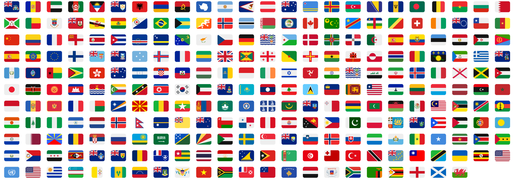
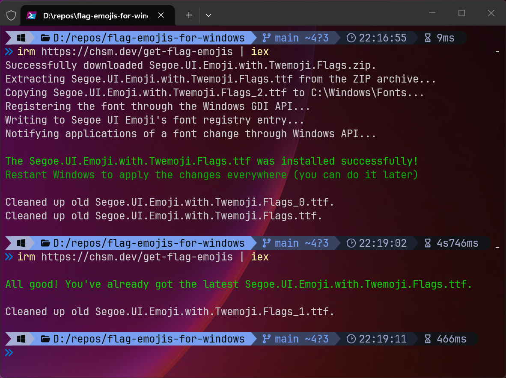

<h1 align="center">Add Country Flag Emojis to Windows 8-11</h1>

<div align="center">
  <p>
    <a href="https://github.com/Chasmical/flag-emojis-for-windows/releases">
      
    </a>
    <a href="https://github.com/Chasmical/flag-emojis-for-windows/subscription">
      
    </a>
    <a href="https://github.com/Chasmical/flag-emojis-for-windows/stargazers">
      
    </a>
    <a href="https://chsm.dev/blog/2026/08/27/flag-emojis-for-windows-8-11-reworked">
      
    </a>
  </p>
</div>

<h2 align="center">This font adds <b>country flag emojis</b> to Windows, while keeping all <b>Win11's original emojis</b>! 🇬🇧🧑‍💻🇯🇵😎🇰🇷💀🇨🇳🤖🇫🇷✨🇪🇸🐛🇮🇹</h2>


Unlike literally any other platform or OS, Windows never had flag emojis, and that always irked me a little bit. Having to guess what flag someone else is trying to send by just two letters isn't a great user experience, you know. And I always just kinda sighed at it, helplessly.

But not today... Today I woke up, and the absence of flag emojis in Windows has triggered me like never before, and so I've spent over 14 hours hyperfocused on this task of bringing flag emojis to Windows (without replacing *all* the emojis, that is, like some other projects did). *Upd: I have since spent a hundred more hours or so on this project.*

And now you too can say *"No!"* to Windows, *"I want the flag emojis that everyone else has!"*, [download and install this font](#installation), restart your PC, and finally get to enjoy the full emoji experience on Windows!

&nbsp;

This font is based on Segoe UI Emoji v1.60 ([3D Fluent 16.0](https://emojipedia.org/microsoft-3D-fluent/fluent-16.0); Win11 25H2; 2025-08-29) and contains 262 flags and 7 new 17.0 emojis from Twemoji v17.0.3 ([`jdecked/twemoji`](https://github.com/jdecked/twemoji)@[`b6b55fe`](https://github.com/jdecked/twemoji/commit/b6b55fef1e8636b540a6d016a4729ca8cdf2e60b) 2026-06-01). You can build it yourself, if you'd like (see the "How to build it yourself" section in the end).


## Latest update v2.2.0 (22 Aug 2026)

- 🛟 Added COLRv1 data for font engines that know COLRv1, but not v0 (see [#16](https://github.com/Chasmical/flag-emojis-for-windows/issues/16)).
- 🐛 Fixed the advance width of `🏴`, which was accidentally halved in a fix for [#13](https://github.com/Chasmical/flag-emojis-for-windows/issues/13).

## Minor update v2.1.0 (31 Jul 2026)

- 🔨 Remade the entire build process with Make.
- 📸 **Now includes new 17.0 emojis that aren't yet in Fluent 3D (see [#10](https://github.com/Chasmical/flag-emojis-for-windows/issues/10)).**
- 🔳 **Added black-and-white rendering support for older apps (see [#12](https://github.com/Chasmical/flag-emojis-for-windows/issues/12)).**
- 🔧 A partial fix for rendering in VSCode's xterm.js terminal (see [#13](https://github.com/Chasmical/flag-emojis-for-windows/issues/13)).
- ⚡️ Optimized the assets with SVGO, and upgraded build scripts API.


## Major update v2.0.0 (6 Jul 2026)

- ✨ **Added support for COLRv0 rendering! Now works on Windows 8-10 too.**
- 💚 Now compiled with the emojis directly from [`jdecked/twemoji`](https://github.com/jdecked/twemoji) repository.
- ⚡️ Removed unnecessary SVG table, decreasing the font's size from 13.1 to 12.1 MB.
- 📏 Fixed the relative width and size of the emojis. Now they're the same size as others.


## Table of contents

1. [Installation](#installation)
2. [Screenshots](#screenshots)
3. [Similar projects & comparison](#similar-projects--comparison)
4. [How to build it yourself](#how-to-build-it-yourself)

Also, you can read my two blog posts on this project!

- 23-Sep-2025, v1: [Bringing flag emojis to Windows 11](https://chsm.dev/blog/2025/09/23/bringing-flag-emojis-to-windows-11)
- 27-Aug-2026, v2: [Flag Emojis for Windows 8-11 Reworked](https://chsm.dev/blog/2026/08/27/flag-emojis-for-windows-8-11-reworked)


## Installation

### [Download the font](https://github.com/Chasmical/flag-emojis-for-windows/releases/latest/download/Segoe.UI.Emoji.with.Twemoji.Flags.ttf) and install it ***for all users***! Restart your PC to apply changes.


**"Install for all users" (recommended)** will attempt to render country flags in the system and many other apps too.

Regular **"Install"** will only affect a few certain apps: Chromium-based browsers (Chrome, Opera, Vivaldi, etc), and Electron-based apps (Discord, VS Code, etc), so if that's enough for you, you can do this type of install.

### Or, alternatively, run this command in PowerShell (Admin):

```sh
irm https://chsm.dev/get-flag-emojis | iex
```

The installer script compares your font's SHA256 checksum with the latest one before downloading, and it also uses less traffic because it downloads the font in a ZIP archive. It also logs errors, which is nice.




### If both installation methods fail, please [open an issue](https://github.com/Chasmical/flag-emojis-for-windows/issues/new/choose)!


#### Uninstalling (if installed for all users)

Recover the original Segoe UI Emoji file: `Copy-Item "C:\Windows\Fonts\seguiemj.ttf"`, and install it for all users.

#### Uninstalling (if installed for current user)

Go to Settings > Personalization > Fonts, and find and select Segoe UI Emoji in the list. In the Metadata section, find the font file that you installed. Press the "Uninstall" button, and restart your PC.


## Screenshots

### It works perfectly in Chromium-based browsers (Chrome, Opera, Vivaldi, etc):


### As well as all Electron-based apps (Discord, VS Code, etc):


### And most non-system apps too (e.g. Notepad++):


### It also works in UWP apps (most of modern system UI):

In a Microsoft Word document:


Fonts preview in "Settings > Personalizations > Fonts":


In the system Start menu:


In the system task bar:


### System Limitations

Country flags are uncolored in the Explorer, but so are the Fluent 3D emojis. So it's not something that **any** font can fix, — it's a limitation of the system itself. Maybe in future versions Windows will be able to render emojis consistently everywhere, but at the moment, it's the best that can be done.


## Similar projects & comparison

- [`perguto/Country-Flag-Emojis-for-Windows`](https://github.com/perguto/Country-Flag-Emojis-for-Windows) replaces Segoe UI Emoji with Google's Noto Color Emoji.

- [`quarrel/broken-flag-emojis-win11-twemoji`](https://github.com/quarrel/broken-flag-emojis-win11-twemoji) replaces Segoe UI Emoji with Twemoji emojis.

Here are the emojis that you get in all projects, for comparison:


I personally prefer the original Fluent 3D set. A touch of 3D shading looks really nice and it brings some life to the emojis. Fluent 3D's people emojis have actual eyes, while others' have creepy dot eyes and blank stares. Also, as someone with entomophobia, Fluent 3D's bug emoji is the easiest to look at, and as a developer I have to look at it pretty often. And look at Fluent 3D's animals! So cute!

And here's a comparison of flags as well:


I decided to use Twitter's flag emojis, since Noto's wavy ones just look weird — straight lines become curves, circles become ovals, there's a weird gray glow around the flags, and they also don't downscale well.


## How to build it yourself

The project's build process is pretty complicated and takes a long time (full run = 5 mins on 20-core CPU), so I put it all in a Makefile, to cache and reuse intermediate results. If you're on Windows, you'll need [WSL](https://learn.microsoft.com/en-us/windows/wsl/install) to run Make and all the Unix commands.

### Prerequisites

- [git](https://git-scm.com/install/windows) for cloning [`jdecked/twemoji`](https://github.com/jdecked/twemoji)'s SVG assets,
- [.NET SDK 10+](https://dotnet.microsoft.com/en-us/download) for running scripts and merging fonts,
- [Python/pip](https://www.python.org/downloads/) for [`nanoemoji`](https://github.com/googlefonts/nanoemoji) and [`fonttools`](https://github.com/fonttools/fonttools), [de]compiling fonts,
- `pip install nanoemoji fonttools[lxml]`
- [Node.js/npm](https://nodejs.org/en/download/current) for [`svgo`](https://github.com/svg/svgo), optimizing SVG assets,
- `npm install -g svgo`
- [Inkscape](https://inkscape.org/release/) for rasterizing SVGs into PNGs,
- [ImageMagick](https://imagemagick.org/download/) for converting PNGs into BMPs,
- [Potrace](https://potrace.sourceforge.net/#downloading) for tracing BMPs into single-color SVGs,
- [HarfBuzz ≥14.2.0 (Apr 2026)](https://github.com/harfbuzz/harfbuzz/releases/latest) for font render tests,
- [7z](https://www.7-zip.org) for packaging the font into a zip file,
- And don't forget to update your `PATH`.

> [!NOTE]
> If you're on a Unix OS natively, you can run this to install all dependencies:
> ```sh
> sudo apt update
> sudo apt install make git dotnet python3 nodejs npm inkscape imagemagick potrace p7zip-full
> sudo pip install nanoemoji fonttools[lxml]
> sudo npm install -g svgo
> ```
> HarfBuzz needs to be built from sources. You'll also need to get `build/seguiemj.ttf` from somewhere.

### Commands

After installing everything, you can run these Make commands (if you're on Windows, run them in WSL):

- `make build` (default) builds the font (`build/merged.ttf`).

- `make package` builds and then copies to `Segoe.UI.Emoji.with.Twemoji.Flags.{ttf,zip}`.

- `make test-vars` prints the commands for the tools that will be used.

- `make test` renders PNGs with all of the flags (`build/tests/`; configurable `make test FLAGS_PER_LINE=8`).

- `make clean` cleans the build cache (simply `rm -rf build`).

- `make rebuild` is a combo of `clean` followed by `build`.

### Notes

The C# merge script I wrote is a bit janky and disorganized, since I've had to try so many different things to finally get it to work... And it probably won't work with any other fonts, despite all my attempts to keep it as generic as possible.

If you want to add emojis to Segoe UI Emoji from some other font, here's a list of resources that I found useful:

- [fontTools ttx](https://fonttools.readthedocs.io/en/latest/ttx.html) can decompile TTF into a readable and editable XML, and recompiles it back losslessly.
- [OpenType's spec on Microsoft Learn](https://learn.microsoft.com/en-us/typography/opentype/spec/) explains the overall structure of a TTF file and its tables, and what different type ids mean, and etc.
- [GSUB docs on FontForge](https://fontforge.org/docs/techref/gposgsub.html) clarifies some stuff about substitution lookups.
- [HarfBuzz](https://harfbuzz.github.io/utilities.html#utilities-command-line-hbview) brought the project to the finish line! It not only renders font characters into the terminal, but also shows the entire textshaping process (run with option `-V`). I was stuck for a while on script and feature switches, not realizing that they disable rendering the ligatures in some places.

You can also read my two blog posts explaining some of the details:

- 23-Sep-2025, v1: [Bringing flag emojis to Windows 11](https://chsm.dev/blog/2025/09/23/bringing-flag-emojis-to-windows-11)
- 27-Aug-2026, v2: [Flag Emojis for Windows 8-11 Reworked](https://chsm.dev/blog/2026/08/27/flag-emojis-for-windows-8-11-reworked)

